# Introduction to Slunk

Slunk keeps track of a music collection. This document is the starting point for the project. It covers:
- what Slunk is and what it must do;
- its data model;
- how the database evolves through migrations;
- how the backend is organized;
- the phases to build it in.

**Design docs.** Slunk's design lives in `docs/design/`, one numbered document per topic (`N_topic.md`), numbered in the order they're written. This one comes first, and later documents build on it.

Design docs are plans, and after that a history of the project. A design doc is only edited while that design is being developed. After that its text stays as it was: when the code shows something has to change, the change is added as an appendix at the end of the doc. What's actually built is documented in the rest of `docs/` ([docs/README.md](../README.md)), and those docs are kept up to date with the code.

| Document | Covers |
|---|---|
| `1_introduction.md` | This document: the foundations listed above |
| `2_external_libraries.md` | Exporting music to other libraries. Planned, not written yet |

## 1. Summary

- Slunk owns a database that is the source of truth for all music metadata. It's a record keeper: it never writes to the user's files, and only records where they are.
- The data model covers:
  - files, artists, albums and tracks;
  - who performs each album and track, credits with user-defined roles, and various-artists albums;
  - file links;
  - typed tags, each single- or multi-value.

  The database itself enforces integrity: `STRICT` tables, foreign keys, CHECKs and triggers.
- Migrations are timestamped TypeScript files in `slunk-be/priv/repo/migrations/`, applied by a small runner built on Kysely. They come with Ecto-style commands (`db:migrate`, `db:rollback`, `db:gen`, …). All pending migrations apply in one transaction, after a backup.
- Backend: Node 26 (runs TypeScript natively), Apollo Server 5 on Express 5, Kysely + better-sqlite3, and Phoenix-style contexts.
- Phases: **0** Foundations → **1** Files → **2** Catalog → **3** Tags → **4** Integrity. Exporting to external libraries comes later, designed in its own doc.

## 2. What Slunk is

Music libraries usually treat the tags embedded in each file as the source of truth. Slunk is its own source of truth instead: it owns a database with all the music's metadata. That lets metadata be stored more accurately than file tags allow, and queried fast.

- **A record keeper.** Slunk never writes to the user's files: no moving, copying, renaming or retagging. The user decides where files live, and Slunk records each file's path relative to its database. The library keeps working as long as the database stays in the same place relative to the files. Removing a file in Slunk only deletes its record, and only once nothing in Slunk uses it.
- **Local.** Slunk runs on the user's machine, so there are no deployments to think about. It handles file operations itself: reading, hashing and serving files to its UI.
- **A proof of concept.** Speed of development comes first everywhere except the database. The database is the one part designed carefully, for the long term.
- **Export comes later.** Slunk's second goal is to export music to other libraries. It still needs planning and will get its own design doc, `2_external_libraries.md`. Until then, the focus is on organizing.

## 3. Requirements

### 3.1 Technical

- One repository, two projects:
  - `slunk-be`, the backend, on Node.js, with its version pinned through mise in a `.tool-versions` file.
  - `slunk-fe`, the frontend, on Vite + React + React Router. A skeleton already exists. It uses shadcn, so all UI code follows shadcn's conventions.
- **Backend:**
  - processes data and answers the frontend's requests;
  - exposes a GraphQL API compliant with Apollo;
  - follows DDD with the repository pattern, structured like Elixir's Phoenix.
- **Database:** SQLite. Because of the repository pattern, it can be swapped for another database later. A migration system must let new migrations be added at any time.

### 3.2 Domain

**Files.** The user registers files that already exist on disk. Each file is a track's audio (`music`), an `image`, or something else (`other`, e.g. a booklet PDF or a rip log). Once registered, files are connected to the data:
- every track is one audio file, and an audio file belongs to at most one track;
- images and other files can be linked to any number of albums, artists and tracks.

**Entities.** The user creates these and connects them:

- **Artists:** any person or group making music, or related to making it. For example U2, Billie Joe Armstrong, Mozart, the Vienna Symphony Orchestra, or "Various Artists".
- **Albums:** a set of tracks, usually sold as an EP, LP and so on. A single counts as an album too, e.g. U2 & Green Day's "The Saints Are Coming". An album can have many artists. On some albums each track names its own performers, for example a compilation by "Various Artists", or a soundtrack by "The High School Musical Cast" where each song names its singers.
- **Tracks:** one unit of music. Every track belongs to one album and is created from one registered audio file. A track names who performs it, which can differ from the album's artists. It can also have guests (features): "Hold On, We're Going Home" by Drake features Majid Jordan.
- **Credits:** everyone else who worked on an album or track, each with a role: producer, writer, conductor, an instrument such as saxophone. The user manages the list of roles.
- **Tags:** arbitrary metadata on albums, such as Genre, Label, Date purchased, Score or Price (USD).
  - Each data type (text, real number, date) has its own tables, so each type is queried with its own operators: text matching, numeric ranges, date ranges.
  - The same design extends later to tags on tracks.

## 4. Data model

### 4.1 Library layout and connection

The database path is set with `SLUNK_DB`. The user's files stay wherever the user keeps them, and Slunk only writes next to the database:

```
~/Music/                      ← the user's library, organized however they like
  slunk.db                    ← SLUNK_DB
  slunk.db-wal, slunk.db-shm  ← SQLite's WAL files
  slunk-backups/              ← pre-migration copies
  Drake/Nothing Was the Same/12 Hold On, We're Going Home.flac
      ↳ files.path = "Drake/Nothing Was the Same/12 Hold On, We're Going Home.flac"
```

Paths in `files.path`:
- are relative to the folder holding `slunk.db` and never absolute, so the database and the files can move together;
- may start with `../` when files sit outside that folder;
- are normalized before they're stored (forward slashes, no `./` or `a/../b`), so one file has exactly one path.

The app's connection sets `foreign_keys = ON`, `journal_mode = WAL` and `busy_timeout = 5000`.

### 4.2 Conventions

- **Strict typing:** every table is `STRICT`, so SQLite rejects, say, text in an integer column.
- **Ids:** `files`, `artists`, `albums` and `tracks` use `INTEGER PRIMARY KEY AUTOINCREMENT`, so a deleted id is never reused. Anything that remembers an id outside the database can't end up pointing at a different row. Other tables use `INTEGER PRIMARY KEY`.
- **Time:** instants (dates, timestamps) are Unix epoch seconds, UTC. Durations are milliseconds.
- **Timestamps:** `inserted_at` / `updated_at` exist on files, artists, albums and tracks. Both default to `unixepoch()`, and the repositories set `updated_at`.
- **Foreign keys:** SQLite ignores foreign keys unless `PRAGMA foreign_keys = ON` is set on the connection, so every connection sets it. SQLite also doesn't index foreign key columns, so every FK column leads some index. Without that index, a delete scans the child table.
- **Delete rules:**
  - CASCADE for pure link rows, when the album, artist or track they describe is deleted.
  - RESTRICT for anything still in use:
    - an album with tracks;
    - a linked or credited artist;
    - a tag definition or credit role in use;
    - a file used anywhere: a track's audio, a cover, a picture or a file link.
- **Naming:** join tables name both sides in alphabetical order: `albums_artists`, `artists_tracks`, `files_tracks`. Credit tables are named after their owner: `album_credits`, `track_credits`.

### 4.3 Design decisions

**Files.**
- `path` is relative, as described in §4.1.
- `size_bytes`, `mtime` and `sha256` let a library check notice changes made outside Slunk:
  - a changed size or mtime means the file needs rehashing;
  - a known hash at a new path means the file moved.
- `sha256` is indexed but not unique. The library may hold the same content twice (one `cover.jpg` per disc folder), and Slunk records what's there.
- `type` is one of `music`, `image`, `other`. A track's file must be `music`, which the app checks when the track is created.
- A file record can only be deleted once nothing uses it: it must not be a track's audio, a cover, a picture, or in a file link. Forgetting a file never silently clears a cover or removes it from an album.
- A file that disappeared from disk keeps its record until the user relinks or unlinks it. The library check shows where it's still used.

**Tracks.**
- `album_id` is required.
- `file_id` is required and unique: every track is an audio file the user has, and tracks are created from registered audio files.
- A file that is a track's audio can't be deleted (RESTRICT); the track goes first. If the file moves on disk, the library check relinks it by hash.
- `duration_ms` is read from the file when the track is created. It's nullable only for files whose duration can't be read.
- `cd_number` defaults to 1.
- `(album_id, cd_number, track_number)` is unique. The same index returns an album's tracks in order.

**Albums.**
- An album's size is computed from its tracks: tracks per disc, and the highest `cd_number` for the number of discs.
  - Every track is a file the user has, so no stored total can disagree with the tracks.
  - The trade-off: an incomplete album (10 of 12 tracks) can't record that the release has 12. A later migration can add that if it's ever needed.
- `cover_picture` and `artists.picture` point to the *primary* image. Other images go through file links.

**Dates.**
- Dates are Unix epoch seconds, UTC. An unknown month or day becomes the first one (`1987` → `1987-01-01T00:00:00Z`). Pre-1970 dates are negative numbers, which works.
- `albums.release_date_precision` (`year`, `month` or `day`) records which parts of the release date are known. That's how "1987" and "1987-01-01" are told apart, and the UI shows only the known parts. Two CHECKs keep the pair consistent:
  - `release_date` and `release_date_precision` are both set or both NULL;
  - the date sits at midnight UTC on the first day of its year or month, matching its precision.
- Date tag values have no precision column and follow the same first-day rule.

**Artists and credits.** Two kinds of links are kept apart, because the app treats them differently:
- **Album and track artists** have a fixed meaning: who the album is by, and who performs each track. They name the album or track, e.g. "Start of Something New — Zac Efron / Vanessa Anne Hudgens".
- **Credits** list everyone else who worked on it, each with a role. They're shown underneath, e.g. "Producer – Mathew Gerrard".

Performers have their own tables, so nothing depends on a particular role existing. Deleting or renaming a role can't change who performs a track.

Album and track artists:
- `albums_artists` holds who the album is by.
- `artists_tracks` holds who performs the track. `featured` (0 or 1, default 0) marks guests, shown as "(feat. …)".
- `position` is the display order ("U2 & Green Day", not "Green Day & U2").
- An artist appears at most once per album or track.

Credits:
- `album_credits` and `track_credits` link an artist to an album or track with a role from `credit_roles`.
- Roles are plain data the user manages, like tag definitions: producer, writer, conductor, an instrument such as saxophone. A role still in use can't be deleted.
- The baseline migration adds starter roles: `composer`, `conductor`, `producer`, `remixer`, `writer`.
- An artist can hold several roles on the same track (producer and writer), and can also be one of its performers.
- `position` is the display order.

**Various-artists albums.** `albums.various_artists` (0 or 1, default 0) marks an album whose tracks each name their own performers: compilations, soundtracks, cast recordings. The album still has artists of its own, either an umbrella name like "The High School Musical Cast" or a plain "Various Artists" artist. So every album has an artist, and sorting or grouping by album artist needs no special case.

Who performs a track:
- **On a regular album:** the track's own non-featured artists, or the album's artists if the track has none.
- **On a various-artists album:** only the track's own non-featured artists, with no fallback. A track sung by the whole cast lists the cast explicitly. A missing artist then gets reported by the library check (phase 4) instead of silently showing the umbrella name.
- **On either kind:** the track's featured artists are added as "(feat. …)".

The UI follows the flag. A various-artists album shows each track's artists in its track list, while a regular album shows only the features.

Examples:
- **Drake, "Nothing Was the Same":** a regular album by Drake. "Hold On, We're Going Home" lists only Majid Jordan, as featured, so Drake performs it: "Hold On, We're Going Home (feat. Majid Jordan)".
- **"High School Musical (Soundtrack)":** a various-artists album by The High School Musical Cast.
  - "Start of Something New" is performed by Zac Efron and Vanessa Anne Hudgens. Its credits are Producer – Mathew Gerrard, and Writer – Mathew Gerrard, Robbie Nevil.
  - "Stick to the Status Quo" is performed by The High School Musical Cast.
- **"The Metallica Blacklist":** a various-artists album by Various Artists. "Nothing Else Matters" is performed by Miley Cyrus, with James Hetfield and Lars Ulrich credited as `writer`.
- **A Mozart recording:** the orchestra performs, Mozart is credited as `composer`, and the conductor as `conductor`.

**File links.** `albums_files`, `artists_files` and `files_tracks` link images and other files to entities. Each link has an optional `note` (e.g. "back cover").

**Tags.**
- Each type has a definition table (`text_tags`, `real_number_tags`, `date_tags`) and a value table (`albums_text_tags`, `albums_real_number_tags`, `albums_date_tags`). The value column has the real type, so numbers and dates compare as numbers.
- `(album_id, tag_id, value)` is unique, which prevents duplicate values.
- `(tag_id, value)` is indexed, which makes filters fast ("Genre = Rock", "Score ≥ 8").
- Tag names and text values use `COLLATE NOCASE`, so "Rock" and "rock" are the same.
- Tag names can repeat across types ("Score" as text and as a real number), so the app checks for that when a tag is created.

**Single-value tags.** Each tag definition has `multiple` (0 or 1, default 0):
- **Single-value (`multiple = 0`):** at most one value per album. Most tags are like this: Score, Price, Date purchased.
- **Multi-value (`multiple = 1`):** several values per album, like Genre.

Without the flag, nothing could keep a tag single-valued. A double submit, or a bulk edit that adds instead of replacing, would leave an album with both Score 6 and Score 9. Sorting by Score would then have to pick one value, "Score ≥ 8" would match the album because of the 9, and an average would count it twice.

Triggers enforce the flag (§4.4). The UI uses it to pick its control: one input that replaces the value, or a list that adds values.

### 4.4 Schema

```mermaid
erDiagram
    files {
        int id PK
        text path UK "relative to the slunk.db folder"
        text type "music, image or other"
        int size_bytes
        int mtime "epoch s"
        text sha256
        int inserted_at
        int updated_at
    }
    artists {
        int id PK
        text name
        int picture FK "nullable"
        int inserted_at
        int updated_at
    }
    albums {
        int id PK
        text title
        int release_date "nullable, epoch s"
        text release_date_precision "nullable; year, month or day"
        int cover_picture FK "nullable"
        int various_artists "0 or 1, default 0"
        int inserted_at
        int updated_at
    }
    tracks {
        int id PK
        text title
        int duration_ms "nullable"
        int track_number
        int cd_number "default 1"
        int album_id FK
        int file_id FK, UK
        int inserted_at
        int updated_at
    }
    albums_artists {
        int id PK
        int album_id FK
        int artist_id FK
        int position "display order"
    }
    artists_tracks {
        int id PK
        int artist_id FK
        int track_id FK
        int featured "0 or 1, default 0"
        int position "display order"
    }
    credit_roles {
        int id PK
        text name UK "producer, writer..."
    }
    album_credits {
        int id PK
        int album_id FK
        int artist_id FK
        int role_id FK
        int position "display order"
    }
    track_credits {
        int id PK
        int track_id FK
        int artist_id FK
        int role_id FK
        int position "display order"
    }
    albums_files {
        int id PK
        int album_id FK
        int file_id FK
        text note "nullable"
    }
    artists_files {
        int id PK
        int artist_id FK
        int file_id FK
        text note "nullable"
    }
    files_tracks {
        int id PK
        int file_id FK
        int track_id FK
        text note "nullable"
    }
    text_tags {
        int id PK
        text name UK
        int multiple "0 or 1, default 0"
    }
    real_number_tags {
        int id PK
        text name UK
        int multiple "0 or 1, default 0"
    }
    date_tags {
        int id PK
        text name UK
        int multiple "0 or 1, default 0"
    }
    albums_text_tags {
        int id PK
        int album_id FK
        int tag_id FK
        text value
    }
    albums_real_number_tags {
        int id PK
        int album_id FK
        int tag_id FK
        real value
    }
    albums_date_tags {
        int id PK
        int album_id FK
        int tag_id FK
        int value "epoch s"
    }

    albums ||--o{ tracks : contains
    files ||--o| tracks : "audio of"
    files |o--o{ albums : "cover of"
    files |o--o{ artists : "picture of"

    albums ||--o{ albums_artists : "is by"
    artists ||--o{ albums_artists : "artist of"
    tracks ||--o{ artists_tracks : "performed by"
    artists ||--o{ artists_tracks : performs

    albums ||--o{ album_credits : credits
    tracks ||--o{ track_credits : credits
    artists ||--o{ album_credits : "credited on"
    artists ||--o{ track_credits : "credited on"
    credit_roles ||--o{ album_credits : "role of"
    credit_roles ||--o{ track_credits : "role of"

    albums ||--o{ albums_files : has
    artists ||--o{ artists_files : has
    tracks ||--o{ files_tracks : has
    files ||--o{ albums_files : "linked as"
    files ||--o{ artists_files : "linked as"
    files ||--o{ files_tracks : "linked as"

    albums ||--o{ albums_text_tags : has
    albums ||--o{ albums_real_number_tags : has
    albums ||--o{ albums_date_tags : has
    text_tags ||--o{ albums_text_tags : "value of"
    real_number_tags ||--o{ albums_real_number_tags : "value of"
    date_tags ||--o{ albums_date_tags : "value of"
```



#### Constraints & indexes

Every table is `STRICT`.

**files**
- `path` unique · index `sha256` (not unique: the same content may sit at two paths)
- `type` in (`music`, `image`, `other`) · `size_bytes >= 0`

**artists**
- index `name COLLATE NOCASE` · index `picture`
- `picture` → files, ON DELETE RESTRICT

**albums**
- index `title COLLATE NOCASE` · index `release_date` · index `cover_picture`
- `cover_picture` → files, ON DELETE RESTRICT
- `various_artists` in (0, 1)
- `release_date_precision` in (`year`, `month`, `day`). It is NULL exactly when `release_date` is NULL.
- `release_date` matches its precision:
  - `day`: midnight UTC (`release_date % 86400 = 0`)
  - `month`: midnight UTC on the 1st
  - `year`: midnight UTC on January 1st

**tracks**
- `(album_id, cd_number, track_number)` unique, which also gives the album's track order
- `file_id` required and unique
- `album_id` → albums, ON DELETE RESTRICT · `file_id` → files, ON DELETE RESTRICT
- `track_number > 0` · `cd_number > 0` · `duration_ms >= 0`
- the file's `type` is `music` (checked by the app)

**albums_artists** / **artists_tracks**
- `(album_id, artist_id)` / `(track_id, artist_id)` unique · index `artist_id`
- album/track side ON DELETE CASCADE · `artist_id` ON DELETE RESTRICT
- `position >= 0` · `artists_tracks.featured` in (0, 1), default 0

**credit_roles**
- `name` unique, `COLLATE NOCASE`
- starter rows from the baseline migration: `composer`, `conductor`, `producer`, `remixer`, `writer`. Nothing depends on them.

**album_credits** / **track_credits**
- `(album_id, artist_id, role_id)` / `(track_id, artist_id, role_id)` unique · index `artist_id` · index `role_id`
- album/track side ON DELETE CASCADE · `artist_id` and `role_id` ON DELETE RESTRICT
- `position >= 0`

**albums_files** / **artists_files** / **files_tracks**
- `(album_id, file_id)` / `(artist_id, file_id)` / `(track_id, file_id)` unique · index `file_id`
- album/artist/track side ON DELETE CASCADE · `file_id` ON DELETE RESTRICT

**text_tags** / **real_number_tags** / **date_tags**
- `name` unique, `COLLATE NOCASE`
- `multiple` in (0, 1), default 0
- trigger: switching `multiple` from 1 to 0 fails while any album has several values for the tag

**albums_text_tags** / **albums_real_number_tags** / **albums_date_tags**
- `(album_id, tag_id, value)` unique · index `(tag_id, value)`
- `album_id` ON DELETE CASCADE · `tag_id` ON DELETE RESTRICT
- `albums_text_tags.value` is `COLLATE NOCASE`
- triggers: a single-value tag holds at most one value per album. Checked on insert, and on any update of `album_id` or `tag_id`. Changing the `value` itself always works, so replacing Score 6 with 9 is a plain update.

**migrations**
- `name` unique (see §5)

The triggers for one value table and its definition table are below. The other two types follow the same pattern.

```sql
CREATE TRIGGER albums_text_tags_single_value_insert
BEFORE INSERT ON albums_text_tags
WHEN (SELECT multiple FROM text_tags WHERE id = NEW.tag_id) = 0
  AND EXISTS (SELECT 1 FROM albums_text_tags
              WHERE album_id = NEW.album_id AND tag_id = NEW.tag_id)
BEGIN
  SELECT RAISE(ABORT, 'single-value tag already set on this album');
END;

CREATE TRIGGER albums_text_tags_single_value_update
BEFORE UPDATE OF album_id, tag_id ON albums_text_tags
WHEN (SELECT multiple FROM text_tags WHERE id = NEW.tag_id) = 0
  AND EXISTS (SELECT 1 FROM albums_text_tags
              WHERE album_id = NEW.album_id AND tag_id = NEW.tag_id AND id <> NEW.id)
BEGIN
  SELECT RAISE(ABORT, 'single-value tag already set on this album');
END;

CREATE TRIGGER text_tags_multiple_off
BEFORE UPDATE OF multiple ON text_tags
WHEN OLD.multiple = 1 AND NEW.multiple = 0
  AND EXISTS (SELECT 1 FROM albums_text_tags WHERE tag_id = NEW.id
              GROUP BY album_id HAVING count(*) > 1)
BEGIN
  SELECT RAISE(ABORT, 'some albums have several values for this tag');
END;
```

## 5. Migration system

### 5.1 Migration files

- Location: `slunk-be/priv/repo/migrations/`, as in Phoenix.
- Name: `YYYYMMDDHHMMSS_snake_case_name.ts`. Sorted by name = applied in order.
- Each file exports `up(db)` and `down(db)`, both taking a Kysely instance.
- Use Kysely's schema builder. Raw `sql` is fine for SQLite-only features (`STRICT`, partial indexes) and for triggers, which the builder doesn't cover.

```ts
// slunk-be/priv/repo/migrations/20261008120000_create_core_schema.ts
import { type Kysely, sql } from "kysely"

export async function up(db: Kysely<unknown>): Promise<void> {
  await db.schema
    .createTable("files")
    .addColumn("id", "integer", (col) => col.primaryKey().autoIncrement())
    .addColumn("path", "text", (col) => col.notNull().unique())
    .addColumn("type", "text", (col) =>
      col.notNull().check(sql`type IN ('music', 'image', 'other')`)
    )
    .addColumn("size_bytes", "integer", (col) =>
      col.notNull().check(sql`size_bytes >= 0`)
    )
    .addColumn("mtime", "integer", (col) => col.notNull())
    .addColumn("sha256", "text", (col) => col.notNull())
    .addColumn("inserted_at", "integer", (col) =>
      col.notNull().defaultTo(sql`(unixepoch())`)
    )
    .addColumn("updated_at", "integer", (col) =>
      col.notNull().defaultTo(sql`(unixepoch())`)
    )
    .modifyEnd(sql`strict`)
    .execute()

  await db.schema
    .createIndex("files_sha256_index")
    .on("files")
    .column("sha256")
    .execute()

  // …the remaining tables of §4.4
}

export async function down(db: Kysely<unknown>): Promise<void> {
  // …drop the remaining tables first, in reverse order
  await db.schema.dropTable("files").execute()
}
```

### 5.2 The runner

The runner is `slunk-be/src/repo/migrator.ts`, about 100 lines, run directly by Node 26 with no build step. It tracks applied migrations in the `migrations` table (`id`, `name` unique, `applied_at`), which it creates on first run.

**Why not Kysely's built-in `Migrator`.** On SQLite it runs migrations without a transaction (its SQLite adapter reports no transactional DDL), and it refuses an outer transaction. A failure halfway through would leave a half-migrated database, and there'd be no point at which to check foreign keys before committing. SQLite itself handles DDL inside transactions fine. Kysely is still used to write the migrations and every query in the app.

**`migrate`** does the following:

1. Opens its own connection with `PRAGMA foreign_keys = OFF`. This is SQLite's documented setup for schema changes, explained in §5.3. The pragma can't change inside a transaction, so it's set first.
2. Compares the files with the `migrations` table. It fails if an applied migration's file is missing, or if a pending file sorts before the last applied one.
3. If anything is pending, runs `VACUUM INTO 'slunk-backups/slunk-<timestamp>.db'`, in the database's folder (§4.1).
4. Runs `BEGIN IMMEDIATE`, which takes the write lock up front so the server's auto-migrate and the CLI can't interleave. It re-reads the pending list, then runs each `up` and records its name.
5. Runs `PRAGMA foreign_key_check`. If any row comes back, it rolls back and reports it.
6. Commits. In dev, it then regenerates the DB types with `kysely-codegen`.

**`rollback [n]`** uses the same envelope. It runs `down` for the last *n* migrations in reverse order and deletes their rows.

### 5.3 Changing an existing table

SQLite's `ALTER TABLE` only adds, renames and drops columns. Changing a type, CHECK, default or FK means rebuilding the table.

With FKs on, the `DROP TABLE` step first deletes every row, which fires `ON DELETE CASCADE`. Rebuilding `artists` would then silently wipe all credits. That's why the runner turns FKs off and relies on the `foreign_key_check` before commit instead.

A `rebuildTable()` helper in `src/repo/` wraps SQLite's recipe:

1. `CREATE TABLE new_x (…)` with the new definition
2. `INSERT INTO new_x (…) SELECT … FROM x`
3. `DROP TABLE x`
4. `ALTER TABLE new_x RENAME TO x`
5. Recreate `x`'s indexes (and any views or triggers that used it)

### 5.4 Commands

Run from `slunk-be/`:

| Script | Ecto equivalent | What it does |
|---|---|---|
| `npm run db:gen -- <name>` | `mix ecto.gen.migration` | Creates `<timestamp>_<name>.ts` from a template |
| `npm run db:migrate` | `mix ecto.migrate` | Backs up the DB, then applies pending migrations |
| `npm run db:rollback -- [n]` | `mix ecto.rollback` | Reverts the last *n* migrations (default 1) |
| `npm run db:status` | `mix ecto.migrations` | Lists applied and pending migrations |
| `npm run db:seed` | `priv/repo/seeds.exs` | Loads sample data from `priv/repo/seeds.ts` |
| `npm run db:reset` | `mix ecto.reset` | Deletes the dev DB, migrates, seeds |

The server runs `migrate` on start. Slunk is a local app with no deploy step, so users never run it by hand.

### 5.5 Rules

- Never edit a migration once it has been applied anywhere. Write a new one.
- Every `down` works, or it throws an explicit "irreversible" error.
- Starter data, like the first credit roles, is inserted by migrations, and nothing may depend on it. Sample data goes in seeds.
- Migrations don't import app code (entities, repositories). App code changes over time; a migration must not.

## 6. Backend shape

| Piece | Choice | Why |
|---|---|---|
| Runtime | Node 26 via mise (`.tool-versions`: `nodejs 26.10.0`) | Runs `.ts` directly, no build step. Same version as `slunk-fe` |
| HTTP + GraphQL | Apollo Server 5 on Express 5 (`@as-integrations/express5`) | Apollo-compliant API. Express also serves file bytes (covers, audio) |
| DB access | Kysely + better-sqlite3 | Typed query builder behind the repositories. Another DB means another dialect and new repository implementations |
| Types | kysely-codegen (DB), graphql-codegen (resolvers, FE documents) | Generated from the DB and the GraphQL schema, so they can't drift |
| Audio | music-metadata | Reads durations, and optionally embedded tags as suggestions |
| Frontend | React Router + Apollo Client + shadcn | As required |

Phoenix-style layout:

```
slunk-be/
  .tool-versions
  package.json
  priv/repo/
    migrations/
    seeds.ts
  src/
    slunk/                 ← domain contexts (Phoenix: lib/slunk)
      catalog/             ← artists, albums, tracks, credits
      media/               ← files, registration, file links
      tagging/             ← tag definitions and values
    slunk_web/             ← (Phoenix: lib/slunk_web)
      endpoint.ts          ← Express + Apollo setup
      schema/              ← GraphQL SDL + resolvers, per context
      files_controller.ts  ← GET /files/:id
    repo/                  ← Kysely instance, SQLite repositories, migrator
```

Dependencies point one way:
- Each context exposes plain functions (`createAlbum`, `linkFile`, …) and declares the repository interfaces it needs.
- `src/repo/` implements those interfaces for SQLite.
- Resolvers only call context functions.

## 7. Phases

Each phase is a vertical slice (migration if needed → repository → context → GraphQL → UI) and ends with something usable.

The baseline migration creates the whole §4.4 schema in phase 0, because the catalog tables already reference `files`. Later phases only add migrations for new things.

**Phase 0 — Foundations**
- Scaffold `slunk-be`: `.tool-versions`, `package.json`, tsconfig (typecheck only), ESLint and Prettier matching `slunk-fe`.
- DB connection, migration runner, baseline migration, `db:*` scripts.
- Apollo Server on Express with a `health` query.
- `slunk-fe`: React Router, Apollo Client, app shell (shadcn sidebar), and a Vite proxy for `/graphql` and `/files`.
- *Exit:* `npm run db:migrate` creates `slunk.db`, and the frontend shows the `health` answer.

**Phase 1 — Files**
- Register files: pick files or scan a folder, then record path, type (from the extension), size, mtime and hash. Slunk only reads them.
- A list of registered files, with a view of files not linked to anything yet.
- Serve files over HTTP (read-only), for viewing and playback.
- *Exit:* registered files can be browsed, viewed and played in the UI, and the files on disk are untouched.

**Phase 2 — Catalog**
- Artists, albums, tracks: list, create, edit, delete. A track is created from a registered audio file, and its duration is read from that file.
- Album and track artists (with features), and the various-artists flag on albums.
- Credit roles (list, add, rename, delete), and credits on albums and tracks.
- Link images and other files to albums, artists and tracks. Set the cover and picture.
- Album page:
  - the track list, grouped by disc;
  - each track's artists on a various-artists album, and only the features on a regular one;
  - credits under each track.
- Optional: prefill new albums and tracks from the file's embedded tags, as suggestions only. Slunk stays the source of truth.
- *Exit:* a user builds a complete album from registered files: tracks, artists, credits and cover.

**Phase 3 — Tags**
- Tag definitions per type (text, real number, date), each single- or multi-value.
- Album tag values, edited on the album page: one input for a single-value tag, a list for a multi-value tag.
- Album list filters per type: text equals or contains, number and date ranges.
- *Exit:* "albums where Genre is Rock and Score ≥ 8" works.

**Phase 4 — Integrity & extras**
- Library check:
  - registered files missing on disk: relink by hash when one moved, or show where it's still used;
  - files whose size or mtime changed (rehash them);
  - unregistered files in scanned folders;
  - albums with no artist;
  - tracks on a various-artists album without their own non-featured artist.
- Backup retention (keep the last N).
- Track tags: the first migration after the baseline, which proves the system extends.
- Bulk edit, e.g. set a tag on many albums.

Files come before Catalog because every track is created from a registered audio file. Tags need albums, so they come after Catalog.

**Later — External libraries (needs planning).** Exporting music to other libraries is Slunk's next goal after these phases. It hasn't been designed yet. Its planning (data model, export and sync) goes in `docs/design/2_external_libraries.md` before any work starts. Nothing in this document depends on it, and its tables will come in as new migrations.
